# SoulCLI - A Terminal with a Soul 🧠


[](https://opensource.org/licenses/MIT)
[](https://www.rust-lang.org/)
[](https://www.python.org/)

**SoulCLI is a next-generation command-line interface that fuses the robustness of a traditional shell with the cognitive power of large language models. It's engineered to be an intelligent and empathetic partner for developers, offering contextual assistance, command analysis, and a touch of personality.**

*Created by **Eshwar Vijay***

## 🚀 Features

*   **Interactive TUI**: A feature-rich terminal user interface built with Rust's `ratatui` and `crossterm`.
*   **LLM-Powered Assistance**: Leverages the Gemini API to provide intelligent suggestions, command explanations, and answers to your questions.
*   **Asynchronous Architecture**: Built with `tokio`, ensuring a non-blocking and responsive user experience.
*   **RESTful API**: A `fastapi` backend that serves the LLM's intelligence to the CLI.
*   **Dynamic Command Analysis**: Automatically get insights into the output of your shell commands.
*   **Smart History & Autocorrection**: A persistent history that learns from your usage and corrects common typos.
*   **Emotional Engine**: A unique "mood" system that reflects the tone of the interaction.

## 🏛️ Architecture

SoulCLI is composed of two main services that communicate over HTTP:

1.  **Rust CLI (Frontend)**: The user-facing application that you interact with in your terminal.
2.  **Python API (Backend)**: A `fastapi` server that acts as a bridge to the Gemini LLM.

### System Architecture Overview

```mermaid
graph TB
    subgraph "Client Layer"
        User["👤 User Terminal"]
    end
    
    subgraph "Frontend Layer"
        CLI["🦀 Rust CLI - SoulShell<br/>• ratatui TUI<br/>• crossterm events<br/>• tokio async runtime<br/>• Command execution"]
    end
    
    subgraph "Backend Layer"
        API["🐍 Python FastAPI Server<br/>• uvicorn ASGI server<br/>• pydantic models<br/>• RESTful endpoints<br/>• Request routing"]
    end
    
    subgraph "AI Layer"
        Gemini["🧠 Google Gemini API<br/>• Natural language processing<br/>• Command analysis<br/>• Intelligent responses"]
    end
    
    User -->|Terminal Commands| CLI
    CLI -->|HTTP Requests JSON| API
    API -->|API Calls| Gemini
    Gemini -->|AI Responses| API
    API -->|HTTP Responses JSON| CLI
    CLI -->|Formatted Output| User
    
    classDef userLayer fill:#e8f4fd,stroke:#1f77b4,stroke-width:2px
    classDef frontendLayer fill:#fff2cc,stroke:#d6b656,stroke-width:2px
    classDef backendLayer fill:#d5e8d4,stroke:#82b366,stroke-width:2px
    classDef aiLayer fill:#ffe6cc,stroke:#d79b00,stroke-width:2px
    
    class User userLayer
    class CLI frontendLayer
    class API backendLayer
    class Gemini aiLayer
```



### Component Interaction Flow


### Technical Stack Details


## 🛠️ Technical Deep Dive

### Rust CLI

The CLI is built with some of the most popular and powerful libraries in the Rust ecosystem:

*   **[ratatui](https://ratatui.rs/)**: A modern library for building terminal user interfaces.
*   **[crossterm](https://github.com/crossterm-rs/crossterm)**: A pure-rust, terminal manipulation library.
*   **[tokio](https://tokio.rs/)**: An asynchronous runtime for Rust, used to handle user input, command execution, and API calls concurrently.

### Python API

The backend is a lightweight and high-performance `fastapi` application:

*   **[fastapi](https://fastapi.tiangolo.com/)**: A modern, fast (high-performance) web framework for building APIs with Python 3.7+.
*   **[uvicorn](https://www.uvicorn.org/)**: A lightning-fast ASGI server, used to run the FastAPI application.
*   **[pydantic](https://docs.pydantic.dev/)**: Data validation and settings management using python type annotations.
*   **[python-dotenv](https://github.com/theskumar/python-dotenv)**: Reads key-value pairs from a `.env` file and can set them as environment variables.

## ⚙️ Installation and Setup

Follow these steps to get SoulCLI up and running on your local machine.

### 1. Prerequisites

Make sure you have the following installed:

*   [Rust](https://www.rust-lang.org/tools/install) (v1.78 or later)
*   [Python](https://www.python.org/downloads/) (v3.9 or later)
*   A [Gemini API Key](https://ai.google.dev/)

### 2. Clone the Repository

```bash
git clone <repository_url>
cd soulcli
```

### 3. Set up the Python Backend

```bash
cd python_api
python3 -m venv venv
source venv/bin/activate
pip install -r requirements.txt
cd ..
```

### 4. Configure your API Key

Create a `.env` file in the `python_api` directory:

```bash
touch python_api/.env
```

Open the file and add your Gemini API key:

```
GEMINI_API_KEY="your_super_secret_api_key"
```

### 5. Launch the Application

We've included a handy script to start both the backend and frontend with a single command:

```bash
chmod +x run.sh
./run.sh
```

This will start the Python API server in the background and the Rust CLI in the foreground.

## 📖 Usage

Once SoulCLI is running, you can use it like a standard shell. Here are some of the things you can do:

*   **Run any shell command**: `ls -l`, `git status`, `docker ps`, etc.
*   **Ask a question**: `what is the capital of France?`
*   **Get an explanation of the previous command's output**: `explain the output of the last command`
*   **Cancel a running command**: Press the `x` key.
*   **Exit SoulCLI**: Press the `Esc` key.

## 🌐 API Endpoints

The Python API server exposes the following endpoints:

*   `POST /query`: Takes a prompt and history, and returns a response from the LLM.
*   `POST /route`: A prompt router that determines the mode and frames the prompt for the LLM.
*   `GET /health`: A health check endpoint.

## 🤝 Contributing

We welcome contributions from the community! If you'd like to contribute, please follow these steps:

1.  Fork the repository.
2.  Create a new branch for your feature or bug fix.
3.  Make your changes and commit them with a clear and descriptive message.
4.  Push your changes to your fork.
5.  Open a pull request to the `master` branch of this repository.

## 🗺️ Roadmap

Here are some of the features we're planning to add in the future:

*   [ ] Support for more LLMs (e.g., OpenAI, Anthropic).
*   [ ] Customizable themes and color schemes.
*   [ ] Plugin system for extending the CLI's functionality.
*   [ ] More advanced command analysis and suggestions.

## 📜 License

This project is licensed under the MIT License. See the [LICENSE](LICENSE) file for details.
